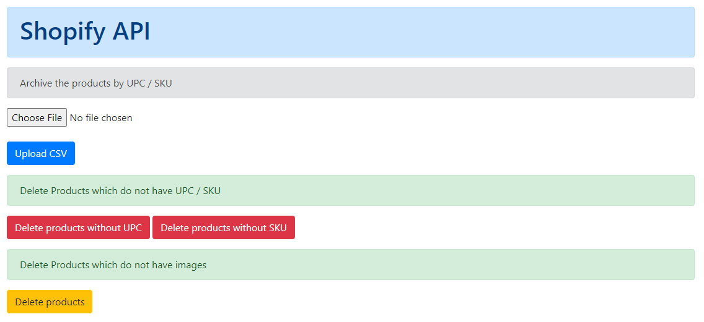

# Shopify Products Updater

## Description
It does the following:
1) Archives the products based on SKU (through CSV)
2) Deletes the products that do not have SKU or UPC
3) Deletes those products which do not have images
